# LazyNote

> **Note:** LazyNote's AI feature is currently in development. Please stay tuned for new updates. I am planning to launch a commercialized version of LazyNote. If you are interested in the idea and want to join our team, please connect with me via xuejiayu@ad.unc.edu

# LazyNote System Design

## Implementation approach

Based on the product requirements, LazyNote is an AI-powered educational application that helps students retain knowledge by automatically generating flashcards and quizzes from lecture slides. The system requires sophisticated AI integration, document processing, user authentication, and an intuitive interface for learning.

### Key Implementation Challenges

1. **Document Processing Pipeline**: Extracting structured content from PDF lecture slides requires robust parsing capabilities and error handling.
2. **AI Content Analysis**: Identifying key concepts and generating high-quality flashcards and quizzes demands effective prompting and AI orchestration.
3. **Spaced Repetition Algorithm**: Implementing an effective learning algorithm that adapts to user performance.
4. **Performance at Scale**: Ensuring the system remains responsive even with many concurrent users and large document libraries.
5. **Real-time Answer Evaluation**: Providing immediate, accurate feedback on quiz responses.

### Selected Technologies

#### Frontend
- **Next.js**: For server-side rendering, optimized performance, and SEO benefits
- **React**: Component-based UI development with state management
- **Tailwind CSS**: Utility-first CSS framework for responsive design
- **Framer Motion**: For smooth animations like card flipping
- **React Query**: For efficient data fetching and caching
- **NextAuth.js**: For Google OAuth integration

#### Backend
- **Node.js**: JavaScript runtime for the server
- **Express.js**: Web framework for REST API endpoints
- **PostgreSQL**: Relational database for structured data
- **Prisma**: ORM for type-safe database access
- **Socket.io**: For real-time updates during document processing
- **PDF.js**: For parsing PDF documents

#### AI and Vector Database
- **OpenAI API**: For content analysis and generation
- **OpenAI Agents SDK**: For orchestrating AI workflows
- **Pinecone**: Vector database for similarity search
- **LangChain**: For structured AI interactions and prompt management

#### Infrastructure
- **Docker**: For containerization
- **AWS S3**: For document storage
- **Redis**: For caching and session management
- **GitHub Actions**: For CI/CD

## Data structures and interfaces

The data structures and interfaces are designed to support the core functionality of the LazyNote application, including user management, document processing, flashcard and quiz generation, and performance tracking.

### Core Domain Models

The following class diagram illustrates the main entities in the LazyNote system and their relationships:

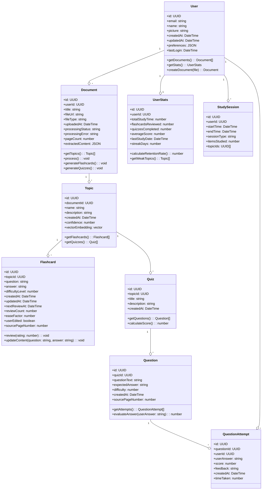

### Service Layer Interfaces

```mermaid
classDiagram
    class AuthService {
        +googleLogin(token: string): User
        +logout(userId: string): void
        +refreshToken(refreshToken: string): string
        +validateToken(token: string): boolean
    }

    class DocumentService {
        +upload(userId: string, file: File): Document
        +getDocuments(userId: string): Document[]
        +getDocument(documentId: string): Document
        +processDocument(documentId: string): void
        +deleteDocument(documentId: string): boolean
    }

    class ContentExtractionService {
        +extractContent(documentId: string): JSON
        +identifyTopics(documentId: string): Topic[]
        +extractImages(documentId: string): Image[]
    }

    class AIService {
        +generateFlashcards(topicId: string): Flashcard[]
        +generateQuizQuestions(topicId: string): Question[]
        +evaluateAnswer(questionId: string, userAnswer: string): EvaluationResult
        +generateFeedback(questionId: string, userAnswer: string): string
    }

    class VectorDBService {
        +indexDocument(documentId: string, content: string): void
        +searchSimilarContent(query: string): SearchResult[]
        +getRecommendedContent(userId: string): RecommendationResult[]
    }

    class FlashcardService {
        +getFlashcards(topicId: string): Flashcard[]
        +getFlashcard(flashcardId: string): Flashcard
        +updateFlashcard(flashcardId: string, data: object): Flashcard
        +reviewFlashcard(flashcardId: string, rating: number): void
        +getDueFlashcards(userId: string): Flashcard[]
    }

    class QuizService {
        +createQuiz(topicId: string): Quiz
        +getQuiz(quizId: string): Quiz
        +submitAnswer(questionId: string, answer: string): EvaluationResult
        +getQuizResults(quizId: string): QuizResult
    }

    class AnalyticsService {
        +getUserStats(userId: string): UserStats
        +getTopicPerformance(userId: string, topicId: string): TopicPerformance
        +recordStudySession(sessionData: object): StudySession
        +getStudyTrends(userId: string, timeframe: string): TrendData
    }

    class SpacedRepetitionService {
        +calculateNextReview(flashcardId: string, rating: number): DateTime
        +getDailyReviewSchedule(userId: string): ReviewSchedule
        +updateEaseFactor(flashcardId: string, rating: number): number
    }
```

### API Endpoints

#### Authentication API

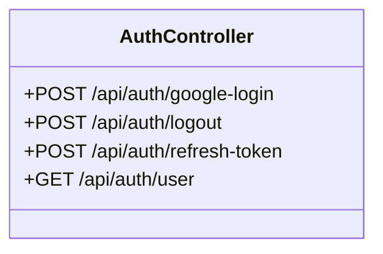

#### Document API

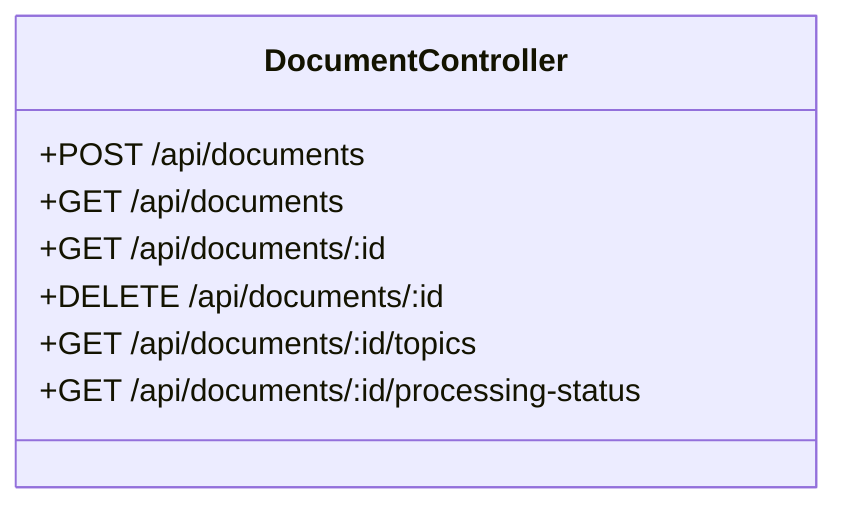

#### Flashcard API

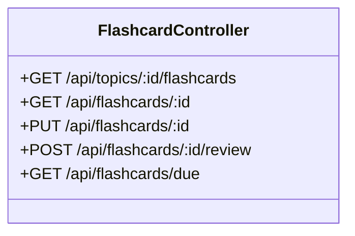

#### Quiz API

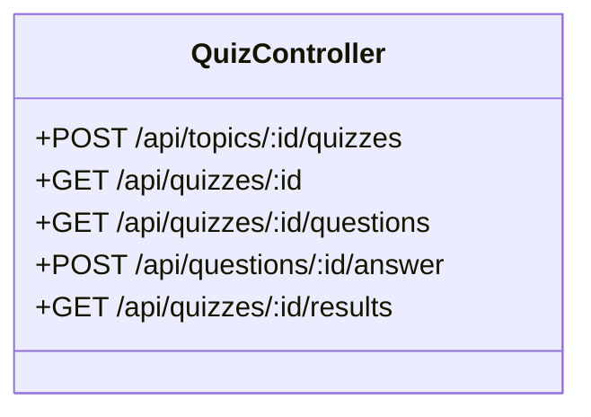

#### Analytics API

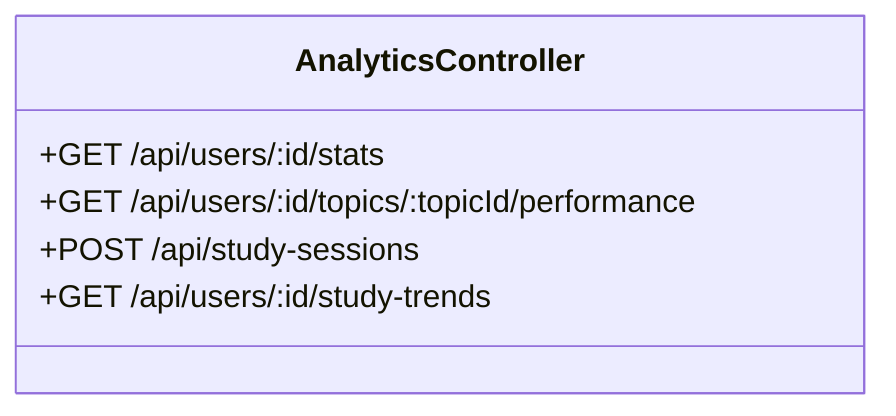

## Program call flow

The following sequence diagrams illustrate the main flows in the LazyNote application.

### User Authentication Flow

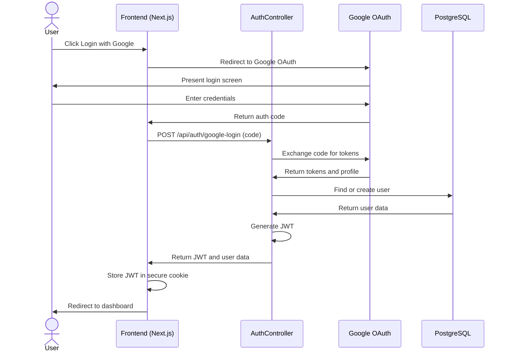

### Document Upload and Processing Flow

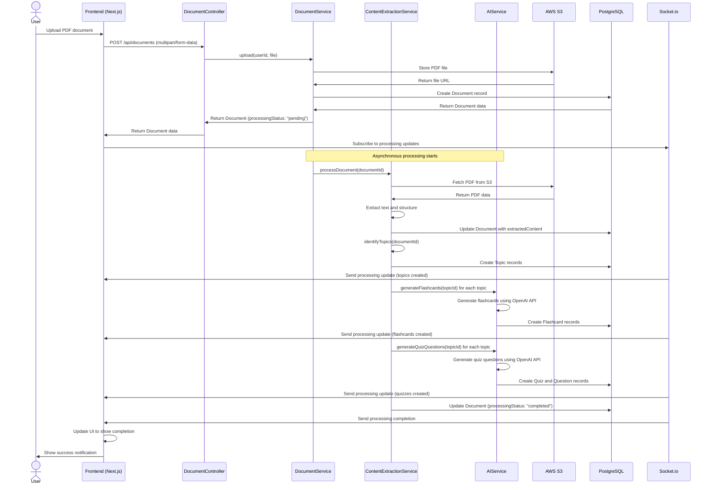

### Flashcard Review Flow

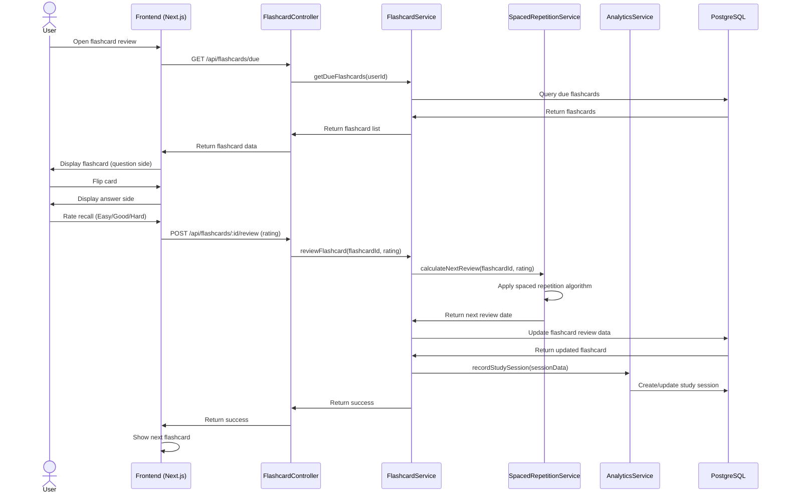

### Quiz Attempt Flow

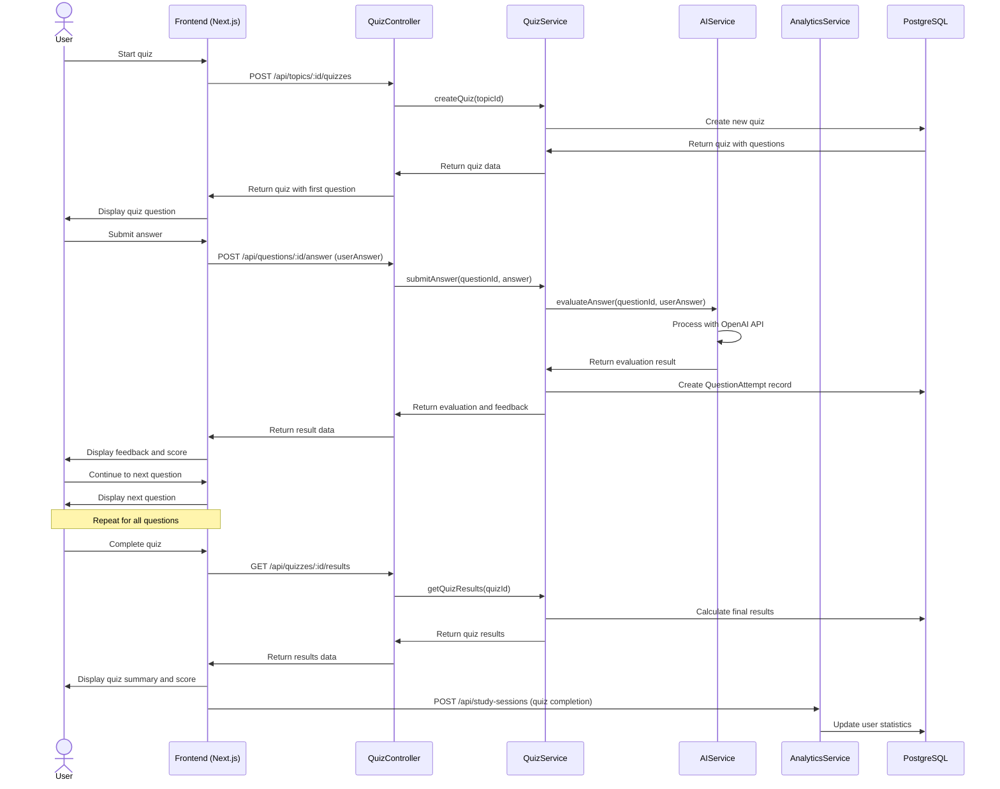

### Analytics Data Flow

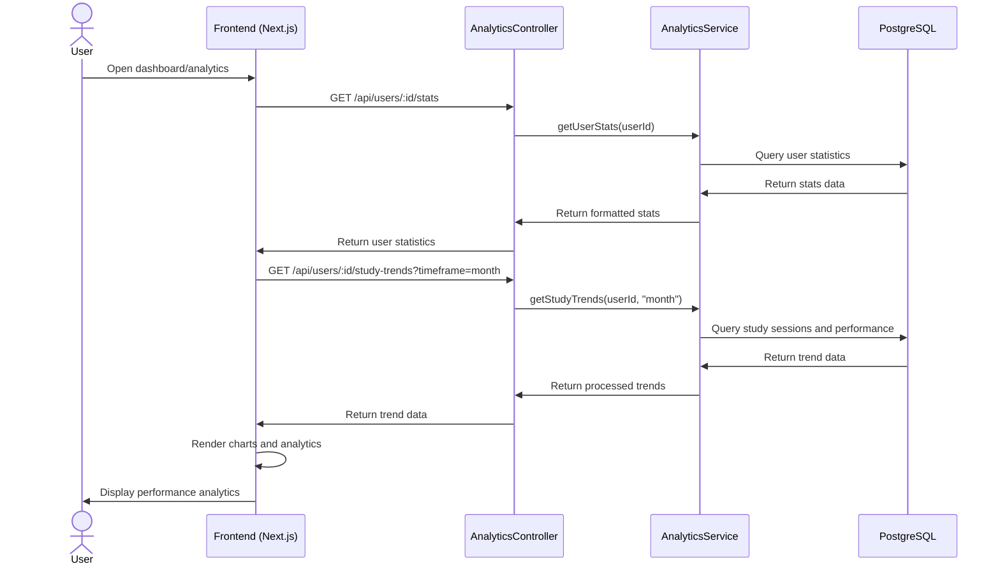

